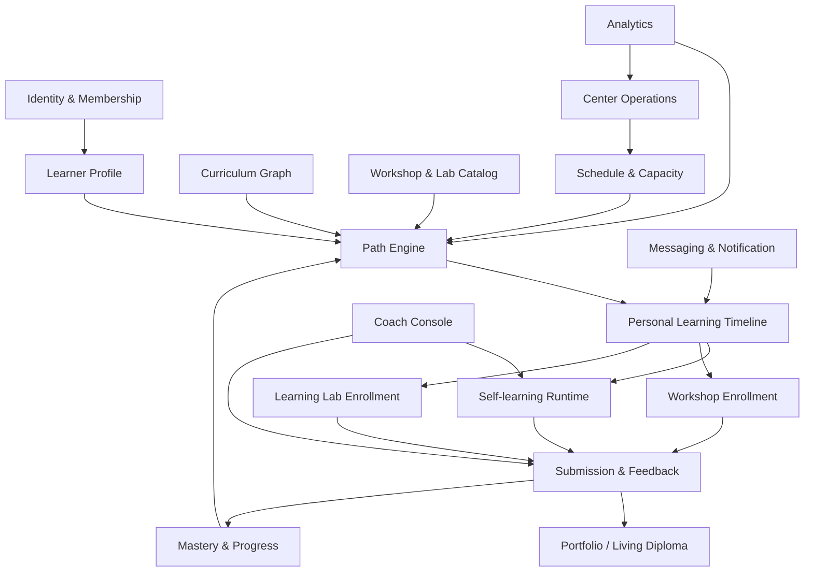

# Nghiên cứu TUMO: mô hình kinh doanh, vận hành giáo dục và công nghệ

> Cập nhật: 2026-08-05  
> Phạm vi: phân tích các nguồn công khai chính thức của TUMO, các trung tâm quốc tế, WISE và OECD.  
> Nguyên tắc: tách rõ nội dung **được công khai**, nội dung **suy luận từ bằng chứng**, và nội dung **không có dữ liệu công khai**.

---

## 1. Kết luận điều hành

TUMO không phải một LMS truyền thống và cũng không chỉ là chuỗi trung tâm đào tạo công nghệ.

Mô hình của TUMO gồm bốn lớp gắn chặt với nhau:

1. **Mô hình giáo dục:** tự học có hướng dẫn, workshop theo cấp độ và learning lab với chuyên gia ngành.
2. **Hệ điều hành học tập:** TUMO Path tạo lộ trình cá nhân, phân bổ hoạt động, workshop, lịch và tài nguyên theo tiến độ từng người học.
3. **Mạng lưới vật lý hub–box:** trung tâm lớn cung cấp workshop/lab; TUMO Box cung cấp tự học tại địa phương với chi phí thấp hơn.
4. **Mô hình tài chính hai tầng:** học miễn phí cho người học; chi phí được tài trợ bởi quỹ, doanh nghiệp, cơ quan công, đối tác địa phương và phí franchise/license từ mạng lưới quốc tế.

Điểm tạo lợi thế không nằm ở số lượng video hoặc khóa học mà ở khả năng dùng chung:

- chương trình;
- phần mềm;
- quy trình vận hành;
- thương hiệu;
- tiêu chuẩn không gian;
- hệ thống đào tạo coach/chuyên gia;
- portfolio và dữ liệu tiến độ;
- mạng lưới đối tác quốc tế.

Đối với dự án Nền tảng đào tạo nghề, phần nên học từ TUMO là:

- nền tảng phải là **learning operating system**, không chỉ là LMS;
- học liệu phải được cấu trúc thành hoạt động, prerequisite, workshop và sản phẩm;
- lộ trình học nên được tạo động dựa trên năng lực, hứng thú, tiến độ và tài nguyên;
- coach/điều phối viên vẫn là vai trò cốt lõi;
- portfolio và hồ sơ minh chứng có giá trị hơn chỉ cấp chứng chỉ;
- mô hình mở rộng nên là **trung tâm nội dung và công nghệ + điểm triển khai địa phương**;
- sản phẩm có thể được cấp quyền cho đơn vị ngoài nhưng lõi nội dung, dữ liệu và thuật toán phải do dự án kiểm soát.

---

## 2. TUMO là gì

TUMO Center for Creative Technologies là chương trình giáo dục ngoài giờ miễn phí dành cho thanh thiếu niên, bắt đầu tại Armenia năm 2011.

Các lĩnh vực được triển khai xoay quanh giao điểm giữa công nghệ và thiết kế, gồm:

- lập trình;
- phát triển web;
- phát triển game;
- hoạt hình;
- thiết kế đồ họa;
- phim;
- âm nhạc;
- 3D;
- robot;
- viết;
- GenAI và các lĩnh vực sáng tạo khác.

TUMO hiện vận hành một mạng lưới quốc tế gồm trung tâm lớn và TUMO Boxes. Các nguồn mới công khai quy mô hàng chục nghìn người học mỗi tuần trên nhiều quốc gia.

### 2.1. Không phải mô hình khóa học cố định

TUMO không tổ chức toàn bộ người học thành các cohort cùng đi qua một giáo trình giống nhau.

Mỗi người học:

- chọn các lĩnh vực quan tâm;
- hoàn thành hoạt động tự học ngắn;
- mở khóa workshop phù hợp;
- tham gia learning lab khi đủ năng lực;
- có lộ trình được cập nhật liên tục;
- tạo portfolio từ sản phẩm thực tế.

### 2.2. Không lấy bằng cấp làm sản phẩm chính

TUMO không nhấn mạnh bằng tốt nghiệp. Portfolio của người học được xem là “living diploma” — bằng chứng sống về năng lực, dự án và quá trình phát triển.

---

## 3. Mô hình giáo dục

## 3.1. Ba tầng hoạt động

### Tầng 1 — Self-learning activities

Đây là các hoạt động tương tác ngắn để:

- giới thiệu kỹ năng;
- kiểm tra hứng thú;
- xây kỹ năng nền;
- chuẩn bị prerequisite cho workshop;
- cho phép người học tự tiến theo nhịp riêng.

Learning Coach không giảng bài theo kiểu truyền thống. Coach có nhiệm vụ:

- giúp người học thoát khỏi bế tắc;
- đặt câu hỏi;
- khuyến khích;
- hỗ trợ định hướng;
- theo dõi mức tham gia;
- chuyển vấn đề cho chuyên gia khi cần.

### Tầng 2 — Workshops

Workshop:

- được dẫn dắt bởi specialist;
- có nhiều cấp độ;
- kéo dài theo chu kỳ, thường khoảng một tháng;
- kết thúc bằng sản phẩm cá nhân hoặc nhóm;
- có prerequisite từ self-learning;
- sản phẩm được đưa vào portfolio.

### Tầng 3 — Learning Labs / Project Labs

Learning Lab:

- do chuyên gia ngành hoặc chuyên gia quốc tế dẫn dắt;
- tập trung vào dự án nâng cao;
- có thể kéo dài vài tuần tới vài tháng;
- kết hợp người học từ nhiều lĩnh vực;
- giải quyết bài toán thực tế;
- tạo exposure với nghề nghiệp và doanh nghiệp.

## 3.2. Không dùng điểm số làm động lực chính

TUMO sử dụng:

- mở khóa nội dung;
- lên level;
- tiếp cận workshop hấp dẫn;
- được tham gia learning lab;
- công bố sản phẩm;
- portfolio;

thay cho cạnh tranh bằng điểm số truyền thống.

Điều này không có nghĩa là không đánh giá. Việc đánh giá được nhúng vào:

- prerequisite;
- hoàn thành hoạt động;
- chất lượng sản phẩm;
- phản hồi của coach/specialist;
- khả năng mở khóa cấp độ tiếp theo.

## 3.3. Học theo sản phẩm

Mỗi workshop tạo ra sản phẩm có thể:

- đăng trong portfolio;
- gửi cuộc thi;
- công bố trên mạng;
- phát hành lên app store;
- trình diễn tại sự kiện;
- dùng làm bằng chứng nghề nghiệp.

## 3.4. Mô hình nhân sự ba tầng

TUMO không dùng giảng viên chuyên gia cho mọi tương tác.

Cấu trúc nhân sự gồm:

1. **Learning Coach:** hỗ trợ số lượng lớn người học trong giai đoạn tự học.
2. **Resident Specialist/Workshop Leader:** dạy workshop theo lĩnh vực.
3. **Industry Expert/Lab Leader:** dẫn dắt dự án nâng cao trong thời gian ngắn.

Đây là một cơ chế tối ưu chi phí và công suất:

- tương tác phổ thông được xử lý bởi coach;
- chuyên môn trung cấp do specialist;
- chuyên gia đắt tiền chỉ dùng cho dự án có giá trị cao.

---

## 4. TUMO Path — lõi công nghệ của mô hình

## 4.1. Những gì được TUMO công khai

TUMO Path là phần mềm nội bộ dùng để:

- tạo lộ trình cá nhân;
- cung cấp nội dung tự học;
- kết hợp hoạt động, workshop và lab;
- xem xét sở thích của người học;
- xem xét tốc độ tiến bộ;
- xem xét hiệu suất;
- xem xét lịch workshop và tài nguyên trung tâm;
- thay đổi lộ trình khi người học đổi lựa chọn;
- tự động cập nhật khi nội dung hoặc tài nguyên thay đổi;
- ghi nhận portfolio và kết quả.

TUMO mô tả Path có thể tạo hàng trăm triệu tổ hợp lộ trình trong chu kỳ học dài.

Path còn có hoặc từng được công khai các chức năng:

- chat cập nhật cá nhân;
- nhắn tin với Learning Coach;
- nhận phản hồi về hoạt động;
- đăng ký workshop;
- thông báo;
- xem tiến độ và level;
- tài khoản người học.

## 4.2. Path không chỉ là recommendation engine

Path đồng thời thực hiện nhiều loại bài toán:

1. **Curriculum graph:** hoạt động nào dẫn tới workshop nào.
2. **Mastery tracking:** người học đã làm gì và đạt mức nào.
3. **Preference model:** người học thích lĩnh vực gì.
4. **Scheduling:** workshop nào đang mở, còn chỗ và phù hợp thời gian.
5. **Resource allocation:** specialist, phòng, thiết bị và chỗ ngồi.
6. **Progression rules:** điều kiện mở khóa cấp độ tiếp theo.
7. **Portfolio:** lưu sản phẩm và bằng chứng.
8. **Communication:** coach, phản hồi, thông báo.

## 4.3. Thuật toán có thể được suy luận

TUMO không công khai source code hoặc công thức thuật toán.

Dựa trên mô tả công khai, một Path Engine tương đương có thể có hàm xếp hạng dạng:

> Điểm hoạt động = mức phù hợp sở thích + khoảng thiếu năng lực + mức sẵn sàng prerequisite + độ phù hợp lịch + tài nguyên còn trống + ưu tiên đa dạng trải nghiệm - rủi ro bỏ cuộc

Đây là suy luận kiến trúc, không phải công thức TUMO công khai.

## 4.4. TUMO Path là lợi thế chiến lược

Lợi thế của Path:

- giảm nhu cầu cố vấn thủ công cho từng người;
- cho phép nhiều lộ trình khác nhau trên cùng một hệ thống;
- tái sử dụng nội dung toàn mạng lưới;
- nối việc học cá nhân với công suất thực tế của trung tâm;
- duy trì trải nghiệm thống nhất giữa các quốc gia;
- tạo dữ liệu để cải thiện chương trình.

---

## 5. TUMO Box và mô hình hub–spoke

## 5.1. TUMO Hub

Hub là trung tâm đầy đủ với:

- khu tự học;
- phòng workshop;
- specialist;
- thiết bị chuyên môn;
- learning labs;
- không gian trình diễn và dự án.

## 5.2. TUMO Box

TUMO Box là điểm vệ tinh nhỏ, triển khai nhanh, có thể làm từ container hoặc không gian nhỏ.

Box chủ yếu cung cấp:

- máy tính và kết nối;
- self-learning;
- coach địa phương;
- truy cập TUMO Path;
- điểm tập trung người học.

Khi tới workshop/lab, người học có thể di chuyển về hub.

## 5.3. Công suất tham chiếu công khai

Các nguồn TUMO công khai các mức công suất khác nhau theo thế hệ/địa điểm:

- khoảng 240 người học mỗi tuần ở một số mô tả cũ;
- khoảng 320 người học mỗi tuần ở một số Box mới.

Sự khác nhau có thể do diện tích, số máy, số ca hoặc thiết kế Box. Không nên lấy một con số làm chuẩn cố định.

## 5.4. Ý nghĩa kinh doanh

Hub–Box giải quyết đồng thời:

- chi phí mặt bằng;
- thiếu chuyên gia ở địa phương;
- khoảng cách địa lý;
- duy trì chất lượng tập trung;
- mở rộng nhanh hơn việc xây trung tâm lớn tại mọi nơi.

---

## 6. Mô hình kinh doanh và tài chính

## 6.1. Pháp nhân và định vị

TUMO tại Armenia hoạt động dưới mô hình tổ chức giáo dục phi lợi nhuận và cung cấp chương trình miễn phí cho thanh thiếu niên.

Người học không phải khách hàng trả tiền trực tiếp.

Khách hàng/người tài trợ kinh tế thực sự gồm:

- nhà sáng lập và quỹ;
- cá nhân hảo tâm;
- doanh nghiệp CSR;
- ngân hàng và tổ chức tài chính;
- cơ quan công;
- chính quyền địa phương;
- đối tác vận hành quốc tế;
- nhà tài trợ cơ sở vật chất;
- đối tác công nghệ và viễn thông.

## 6.2. Mô hình tài chính tại Armenia

Nguồn thu/tài trợ gồm:

- đóng góp của nhà sáng lập;
- tài trợ xây trung tâm;
- tài trợ vận hành;
- tài trợ thiết bị;
- tài trợ cho Box;
- tài trợ vận chuyển Box–Hub;
- ưu đãi dịch vụ viễn thông;
- tài trợ dự án;
- phí franchise/license từ trung tâm quốc tế.

## 6.3. Mô hình quốc tế

Các bằng chứng công khai cho thấy TUMO mở rộng qua hợp tác với:

- quỹ địa phương;
- ngân hàng phát triển;
- tổ chức phi lợi nhuận;
- thành phố;
- trường học;
- doanh nghiệp;
- nhóm nhà tài trợ.

Mô hình có thể được hiểu như sau:

### TUMO trung tâm cung cấp

- thương hiệu;
- chương trình;
- TUMO Path;
- tiêu chuẩn giáo dục;
- thiết kế vận hành;
- đào tạo đội ngũ;
- hỗ trợ triển khai;
- cập nhật nội dung;
- tiêu chuẩn không gian và trải nghiệm;
- mạng lưới chuyên gia.

### Đối tác địa phương cung cấp

- pháp nhân vận hành;
- tài chính;
- địa điểm;
- xây dựng/cải tạo;
- thiết bị;
- nhân sự địa phương;
- tuyển sinh;
- quan hệ phụ huynh/trường học;
- chi phí vận hành thường xuyên.

TUMO công khai rằng phí franchise từ trung tâm quốc tế đóng góp vào việc giữ chương trình miễn phí tại Armenia.

Chi tiết công thức phí, tỷ lệ hoặc hợp đồng không được công khai.

## 6.4. Cross-subsidy

TUMO dùng một vòng tài chính đáng chú ý:

1. Phát triển IP giáo dục và phần mềm ở Armenia.
2. Cấp quyền/franchise mô hình ra quốc tế.
3. Thu phí từ mạng lưới quốc tế.
4. Dùng nguồn thu đó để hỗ trợ chương trình miễn phí tại Armenia.
5. Mở rộng mạng lưới làm thương hiệu và IP mạnh hơn.

## 6.5. Các số liệu chi phí tham chiếu lịch sử

Trang vận động tài trợ TUMO Armenia từng công khai các mốc:

- 70.000 USD: một năm vận hành cho 500 người học;
- 45.000 USD: một năm vận hành một Box;
- 25.000 USD: thiết bị cho một phòng workshop;
- 1.500 USD: một workstation;
- 140 USD: chi phí vận hành một người học/năm.

Đây là số liệu truyền thông gây quỹ ở một thời điểm cụ thể, không phải bảng chi phí hiện hành và không thể chuyển thẳng sang Việt Nam.

## 6.6. Các đòn bẩy kinh tế

### Nội dung dùng chung

Một hoạt động được sản xuất một lần có thể phục vụ nhiều trung tâm và nhiều quốc gia.

### Phần mềm dùng chung

TUMO Path được triển khai trên mạng lưới toàn cầu, giúp giảm chi phí quản lý lộ trình trên từng trung tâm.

### Nhân sự phân tầng

Coach xử lý khối lượng lớn; specialist và expert chỉ tham gia nơi cần thiết.

### Đối tác chịu capex/opex địa phương

TUMO không phải tự đầu tư toàn bộ mọi trung tâm quốc tế.

### Chuyên gia ngành

Learning Lab tận dụng chuyên gia doanh nghiệp và cộng đồng chuyên môn, tạo trải nghiệm giá trị cao mà không phải tuyển toàn thời gian cho mọi lĩnh vực.

### Portfolio tạo bằng chứng tác động

Sản phẩm người học hỗ trợ:

- truyền thông;
- gây quỹ;
- tuyển sinh;
- chứng minh kết quả;
- thu hút doanh nghiệp;
- thu hút chuyên gia.

---

## 7. Công nghệ được xác nhận công khai

## 7.1. Nền tảng in-house, cloud-based

TUMO công khai rằng đội sản phẩm phần mềm xây và vận hành một nền tảng học trực tuyến trên cloud, dùng tại các trung tâm trên toàn thế giới.

## 7.2. Hạ tầng/DevOps

Một mô tả tuyển dụng chính thức của TUMO nhắc tới:

- Microsoft Azure;
- Docker;
- monitoring;
- DevOps;
- Agile/Scrum;
- sprint planning;
- backlog grooming;
- product management.

Những công nghệ được xác nhận chỉ ở mức này.

## 7.3. Những gì không được công khai

Không có nguồn chính thức đủ tin cậy để khẳng định:

- ngôn ngữ backend hiện tại;
- frontend framework của TUMO Path;
- loại database;
- message queue;
- kiến trúc microservice hay monolith;
- Kubernetes;
- hệ thống recommendation cụ thể;
- model AI cụ thể đang dùng cho co-learner;
- vector database;
- nhà cung cấp LLM;
- thuật toán scheduling.

Các workshop của TUMO có dạy React, Relay, GraphQL, Ruby on Rails, PostgreSQL, Vue, Node.js và Python, nhưng đó là nội dung đào tạo, không phải bằng chứng về stack sản phẩm nội bộ.

---

## 8. Kiến trúc TUMO có thể suy luận

Đây là mô hình suy luận từ chức năng công khai, không phải sơ đồ chính thức của TUMO.

### 8.1. Các domain service có khả năng tồn tại

- Identity/Membership.
- Student Profile.
- Curriculum and Content.
- Prerequisite Graph.
- Learning Path Engine.
- Workshop Catalog.
- Scheduling and Capacity.
- Enrollment.
- Submission and Feedback.
- Portfolio.
- Coach Communication.
- Center Operations.
- Notifications.
- Analytics.
- International/Multi-center Configuration.

### 8.2. Multi-tenant hoặc multi-center

Do một nền tảng được dùng tại nhiều quốc gia và trung tâm, kiến trúc phải hỗ trợ tối thiểu:

- cấu hình theo trung tâm;
- ngôn ngữ;
- múi giờ;
- lịch địa phương;
- danh mục workshop;
- công suất;
- nhân sự;
- phân quyền;
- tách dữ liệu;
- báo cáo mạng lưới.

---

## 9. AI co-learner

## 9.1. Khác với chatbot gia sư

TUMO định vị AI như một người bạn cùng học, không phải giáo viên trả lời mọi câu hỏi.

Các pattern được công khai:

### Learn by teaching

AI cố tình gặp khó hoặc mắc lỗi để người học giải thích lại khái niệm.

### Learn by observing

Khi người học chưa biết bắt đầu, AI làm thử trước để người học quan sát.

### Targeted improvement

AI chỉ ra chỗ có thể cải thiện trong sản phẩm.

### Contextual adaptation

AI điều chỉnh theo tốc độ và ngữ cảnh người học.

## 9.2. Ý nghĩa sư phạm

Cách này tránh một số vấn đề của chatbot thông thường:

- đưa đáp án quá nhanh;
- làm thay người học;
- tạo lệ thuộc;
- giảm tư duy phản biện.

## 9.3. Kết quả được WISE công khai

WISE công bố mô hình AI của TUMO đạt tỷ lệ thành công cao ở lần thử đầu và giảm đáng kể thời gian phản hồi của giáo viên trong các pilot.

Cần lưu ý:

- đây là kết quả do chương trình/giải thưởng công bố;
- chưa có đầy đủ paper kỹ thuật công khai để kiểm tra thiết kế thí nghiệm;
- không nên chuyển số liệu đó thành cam kết cho nền tảng khác.

---

## 10. Những thứ nên học và không nên sao chép

## 10.1. Nên học

- Learning path động.
- Curriculum graph.
- Coach thay vì chỉ giáo viên.
- Sản phẩm và portfolio.
- Hub–spoke.
- Phân tầng nhân sự.
- Đối tác địa phương chịu phần lớn vận hành.
- IP trung tâm được tái sử dụng.
- Cấp quyền/franchise quốc tế.
- Học miễn phí hoặc được bên thứ ba tài trợ.
- AI hỗ trợ phương pháp học, không chỉ trả lời.

## 10.2. Không nên sao chép nguyên trạng

- Không cohort, không điểm, không chứng chỉ: không phù hợp hoàn toàn với đại học/cao đẳng Việt Nam.
- Lộ trình hai năm: chương trình hiện tại của dự án chỉ 12–15 buổi.
- Chuyển toàn bộ quyền sở hữu sản phẩm người học cho tổ chức: cần xem xét pháp lý và đạo đức tại Việt Nam.
- Xây trung tâm vật lý lớn trước khi chứng minh vận hành số.
- Bắt buộc mọi người học di chuyển về hub.
- Tự phát triển toàn bộ phần mềm ngay từ đầu.

---

## 11. Mô hình kinh doanh đề xuất cho dự án

## 11.1. B2B2C với trường là trục chính

Người học là người sử dụng. Trường, doanh nghiệp, nhà tài trợ hoặc địa phương là khách hàng trả tiền.

### Nguồn thu

1. Phí triển khai ban đầu.
2. Phí cấp quyền chương trình.
3. Phí nền tảng theo trường/năm.
4. Phí theo active learner hoặc capacity band.
5. Phí đào tạo giảng viên/coach.
6. Phí workshop/lab chuyên gia.
7. Phí AI usage.
8. Phí white-label.
9. Phí báo cáo và dữ liệu nâng cao.
10. Phí tích hợp Grapuco cho Vibe Coding.
11. Gói tài trợ cohort từ doanh nghiệp.
12. Gói phát triển chương trình theo đặt hàng.

## 11.2. Mô hình Hub–Node phù hợp Việt Nam

### Hub

Một trường hoặc trung tâm có:

- phòng lab đầy đủ;
- giảng viên/chuyên gia;
- sự kiện dự án;
- workshop nâng cao;
- hỗ trợ các đơn vị lân cận.

### Node

Một khoa, cơ sở, trường liên kết hoặc phòng học nhỏ có:

- máy tính;
- điều phối viên;
- self-learning;
- lớp online/hybrid;
- kết nối về Hub cho lab nâng cao.

Không cần dùng container như TUMO Box. “Node” là mô hình vận hành, không phải kiểu công trình.

## 11.3. Franchise nhẹ thay vì franchise đầy đủ ở giai đoạn đầu

Giai đoạn đầu nên bán:

- chương trình;
- nền tảng;
- đào tạo đội ngũ;
- bộ tiêu chuẩn vận hành;
- báo cáo;
- hỗ trợ;

Không nên gọi là franchise trước khi:

- thương hiệu đủ mạnh;
- SOP ổn định;
- unit economics được đo;
- chất lượng có thể kiểm soát;
- pháp lý hợp đồng hoàn chỉnh.

Tên phù hợp hơn trong năm đầu:

- Licensed Program Partner;
- Authorized Delivery Partner;
- University Hub Partner;
- Training Node Partner.

---

## 12. Bài học chiến lược quan trọng nhất

TUMO thành công không phải vì có nhiều môn học. Họ thành công vì biến chương trình giáo dục thành một hệ thống có thể nhân rộng:

> Nội dung có cấu trúc + lộ trình cá nhân + phần mềm + coach + specialist + expert lab + portfolio + đối tác địa phương + tài chính trung tâm.

Đối với dự án hiện tại, ưu tiên không nên là xây một LMS đầy đủ tính năng. Ưu tiên là xây một lõi có thể:

- nhập các chương trình anh Đức đã soạn;
- biến chúng thành graph hoạt động–năng lực–prerequisite;
- tổ chức lớp ở nhiều trường;
- theo dõi sản phẩm và rubric;
- tạo portfolio;
- đề xuất bước học tiếp theo;
- kết nối Grapuco cho các dự án Vibe Coding;
- cung cấp báo cáo cho trường;
- cho phép đối tác triển khai mà vẫn giữ kiểm soát chất lượng.

---

## 13. Nguồn tham khảo chính

### Nguồn chính thức TUMO

- About TUMO.
- Education Program.
- To and Through the TUMO Path.
- TUMO Awarded WISE Prize for Education for its AI Solution.
- TUMO’s AI Curriculum Moves Forward.
- TUMO 2024: Wrapping Up a Year of Unwrapping Possibilities.
- TUMO Armenia donation and Hub/Box campaign pages.
- TUMO Box and Dream campaign pages.
- Public Offer/General Terms and Provisions.
- Privacy Policy.
- Epic Jobs / Scrum Master–Product Manager description.
- International center partnership announcements.

### Nguồn bên ngoài

- WISE Prize for Education — TUMO.
- OECD SME Policy Index and Armenia digital transformation reports.

---

## 14. Mức độ chắc chắn

| Nhận định | Mức chắc chắn |
|---|---|
| TUMO miễn phí cho người học tại Armenia | Cao |
| Ba tầng self-learning–workshop–lab | Cao |
| TUMO Path tạo lộ trình động | Cao |
| Azure, Docker, Monitoring được đội sản phẩm dùng | Trung bình–cao, từ tuyển dụng chính thức |
| Franchise fees quốc tế hỗ trợ Armenia | Cao |
| Đối tác địa phương chịu phần lớn capex/opex | Trung bình–cao, suy ra từ nhiều thông báo hợp tác |
| Kiến trúc domain/service cụ thể | Trung bình, suy luận |
| Ngôn ngữ, database, framework backend | Không xác định |
| Công thức recommendation/path | Không xác định |
| Giá franchise/license | Không có dữ liệu công khai |
