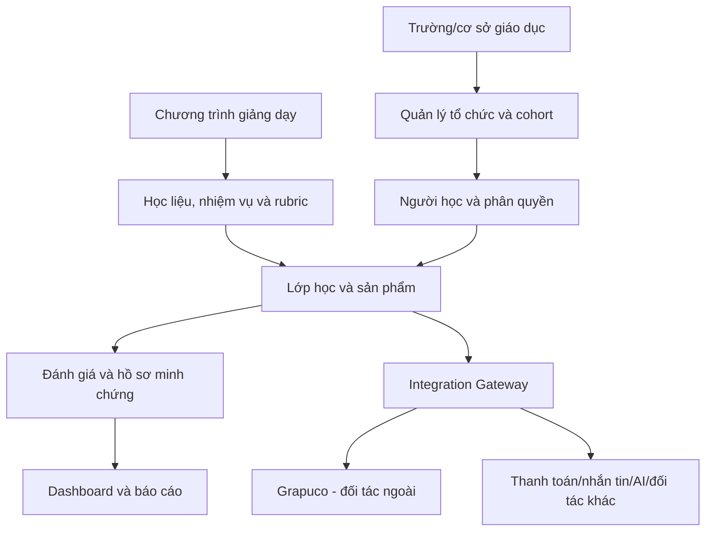

# Mô hình nền tảng

> Nền tảng được xây mới hoàn toàn cho dự án này. Không kế thừa source code, dữ liệu, workflow hoặc kiến trúc từ hệ thống khác.
>
> Grapuco là đối tác công nghệ bên ngoài, được kết nối qua API/MCP hoặc hình thức thỏa thuận riêng.

## 1. Nguyên tắc kiến trúc

- **Greenfield:** codebase và dữ liệu mới.
- **Modular:** phân hệ có thể phát triển/thay thế độc lập.
- **API-first:** mọi đối tác ngoài đi qua interface rõ ràng.
- **Data ownership:** dữ liệu cốt lõi nằm trong hệ thống do dự án kiểm soát.
- **Human-in-the-loop:** con người phê duyệt nội dung, đánh giá và quyết định quan trọng.
- **Vendor independence:** nền tảng hoạt động được khi một đối tác ngoài gián đoạn.
- **Multi-tenant:** quản lý nhiều trường/cơ sở trên cùng nền tảng nhưng tách dữ liệu và quyền truy cập.
- **Auditability:** hoạt động quan trọng có log và khả năng truy vết.

## 2. Kiến trúc tổng quan

## 3. Phân hệ lõi

### 3.1. Quản lý tổ chức

- trường/cơ sở;
- khoa/phòng ban;
- chương trình hợp tác;
- đầu mối;
- hợp đồng hoặc gói dịch vụ;
- phân tách dữ liệu theo đơn vị.

### 3.2. Quản lý chương trình

- chương trình;
- phiên bản;
- cấu trúc buổi học;
- học liệu;
- bài tập;
- rubric;
- đầu ra;
- quyền sử dụng;
- lịch sử cập nhật.

### 3.3. Quản lý cohort và lớp

- cohort;
- danh sách người học;
- giảng viên/trợ giảng;
- trạng thái tham gia;
- lịch buổi học;
- điểm danh;
- nhiệm vụ;
- tiến độ;
- hỗ trợ và sự cố.

### 3.4. Học liệu và nhiệm vụ

- video, slide, bài đọc;
- hướng dẫn thực hành;
- bài tập cá nhân/nhóm;
- dự án cuối khóa;
- file, link và repository;
- deadline;
- lịch sử nộp bài.

### 3.5. Đánh giá

- rubric;
- người chấm/người duyệt;
- nhận xét;
- điểm;
- chấm lại/khiếu nại;
- minh chứng;
- tiêu chí hoàn thành;
- báo cáo chất lượng.

### 3.6. Portfolio và dữ liệu năng lực

- sản phẩm;
- code;
- tài liệu;
- video/demo;
- rubric;
- phản hồi;
- năng lực được minh chứng;
- lịch sử học tập;
- quyền xem/chia sẻ.

### 3.7. Dashboard

#### Cho dự án

- trường và cohort;
- người học;
- tiến độ;
- tỷ lệ hoàn thành;
- ticket;
- chất lượng;
- doanh thu và công nợ;
- mức sử dụng nền tảng.

#### Cho trường

- danh sách;
- điểm danh;
- tiến độ;
- kết quả;
- sản phẩm;
- báo cáo tổng hợp;
- ngoại lệ cần xử lý.

### 3.8. Thanh toán và đối soát

Có thể tự xây hoặc tích hợp nhà cung cấp:

- đơn hàng/học phí;
- trạng thái thanh toán;
- mã giao dịch;
- phần chia sẻ;
- hoàn tiền;
- hóa đơn/chứng từ;
- đối soát;
- báo cáo công nợ.

Không kế thừa hệ thống thanh toán cũ.

## 4. Integration Gateway

Mọi dịch vụ ngoài đi qua lớp tích hợp chung.

Chức năng:

- OAuth/API key/token;
- mapping tài khoản;
- quyền truy cập;
- quota;
- webhook;
- retry;
- logging;
- giới hạn dữ liệu;
- thu hồi quyền;
- theo dõi lỗi/SLA.

Đối tác có thể gồm:

- Grapuco;
- cổng thanh toán;
- email/SMS/Zalo;
- cloud storage;
- AI model/API;
- video conference;
- analytics;
- các công cụ đào tạo khác.

## 5. Tích hợp Grapuco

### 5.1. Vai trò

Grapuco là đối tác ngoài hỗ trợ codebase intelligence cho Vibe Coding và AI coding.

Khả năng dự kiến:

- bản đồ module;
- dependency graph;
- call graph;
- flow;
- context cho AI coding tools;
- spec-first/vibe designing;
- phân tích tác động;
- hỗ trợ trình bày kiến trúc.

### 5.2. Dữ liệu được phép trao đổi

Theo mặc định chỉ trao đổi:

- identifier của project;
- repository được người dùng cho phép;
- metadata tích hợp;
- kết quả/bản đồ được phép hiển thị;
- trạng thái và lỗi tích hợp.

Không mặc định gửi:

- họ tên, số điện thoại, email của người học;
- điểm số;
- dữ liệu thanh toán;
- dữ liệu trường không liên quan;
- repository khác;
- secret, token, credential;
- dữ liệu nhạy cảm trong code.

### 5.3. Quyền và consent

- Người dùng phải biết repository nào được kết nối.
- Quyền phải ở mức tối thiểu.
- Có chức năng ngắt kết nối.
- Có chính sách xóa/lưu trữ.
- Ghi log việc kết nối và truy cập.
- Trường hợp sinh viên dùng repository cá nhân phải có điều khoản quyền sở hữu rõ.

### 5.4. Fallback

Nếu Grapuco chưa có hoặc gián đoạn:

- người học vẫn dùng GitHub và tài liệu kiến trúc thủ công;
- giảng viên vẫn chấm sản phẩm bằng rubric;
- nền tảng vẫn nhận bài, lưu minh chứng và báo cáo;
- không ngừng lớp hoặc mất dữ liệu cốt lõi.

## 6. Phân hệ AI

AI là lớp dịch vụ mới, không kế thừa agent/RAG cũ.

Có thể phát triển:

- trợ lý học tập trên học liệu;
- hỗ trợ giảng viên soạn nội dung;
- gợi ý rubric;
- chấm sơ bộ;
- phát hiện bài cần người duyệt;
- tóm tắt tiến độ;
- hỗ trợ kỹ thuật tuyến đầu.

Nguyên tắc:

- có nguồn và phạm vi rõ;
- không tự quyết kết quả cuối;
- theo dõi chi phí;
- ghi log;
- có cơ chế chuyển người thật;
- không gửi dữ liệu sang model/đối tác ngoài vượt phạm vi cho phép.

## 7. MVP tháng đầu

### Bắt buộc

- quản lý trường;
- chương trình;
- cohort;
- người học;
- vai trò;
- học liệu;
- nhiệm vụ và nộp bài;
- rubric và kết quả;
- điểm danh/trạng thái;
- báo cáo cơ bản;
- audit log tối thiểu.

### Có thể dùng tạm dịch vụ ngoài

- video conference;
- thanh toán;
- email/SMS/Zalo;
- lưu trữ file;
- analytics.

### Chưa bắt buộc

- AI tutor đầy đủ;
- skill graph hoàn chỉnh;
- chấm tự động toàn bộ;
- white-label sâu;
- việc làm/đặt hàng nhân lực;
- Grapuco bắt buộc cho mọi người học.

## 8. Lộ trình nền tảng

### Tháng 1

- MVP cho 2–3 trường;
- dữ liệu lõi;
- báo cáo cơ bản;
- thiết kế integration gateway;
- khảo sát/tích hợp thử Grapuco nếu thỏa thuận sẵn sàng.

### Tháng 2–3

- đa trường/đa cohort;
- thanh toán/đối soát;
- dashboard nâng cao;
- notification;
- quản lý support;
- tích hợp Grapuco bản đầu nếu được duyệt.

### Tháng 4–6

- cấp quyền chương trình;
- onboarding trường;
- portfolio;
- API cho đối tác;
- báo cáo năng lực;
- quản trị quota/billing Grapuco.

### Tháng 7–9

- AI trợ lý/chấm sơ bộ;
- data analytics;
- nhiều chương trình;
- giảng viên nguồn;
- mở rộng Grapuco sang gói doanh nghiệp khi có nhu cầu.

### Tháng 10–12

- gia hạn;
- white-label có kiểm soát;
- chuẩn hóa dữ liệu năng lực;
- đánh giá tự xây/mua/tích hợp;
- chuẩn bị kiến trúc năm hai.

## 9. Bảo mật và pháp lý

- phân quyền theo vai trò và đơn vị;
- mã hóa khi truyền và lưu trữ phù hợp;
- backup và khôi phục;
- quản lý secret;
- log truy cập;
- chính sách lưu/xóa dữ liệu;
- điều khoản quyền sở hữu học liệu, code và sản phẩm;
- DPA/thỏa thuận xử lý dữ liệu với đối tác nếu cần;
- không chia sẻ dữ liệu cá nhân với Grapuco theo mặc định.

## 10. Kết luận

Nền tảng là một codebase và hệ thống dữ liệu mới. Chương trình giảng dạy là tài sản duy nhất được kế thừa. Grapuco được kết nối như một dịch vụ bên ngoài qua lớp tích hợp, tạo giá trị cho Vibe Coding nhưng không nắm quyền kiểm soát nền tảng, dữ liệu hoặc khả năng vận hành lớp học.
