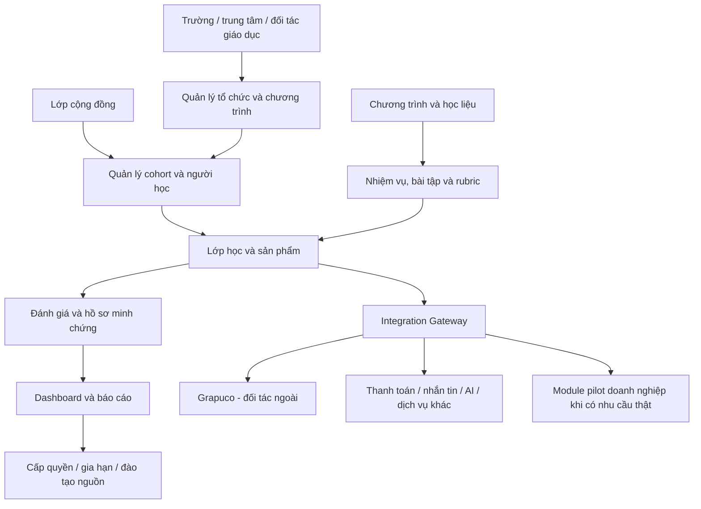

# Mô hình nền tảng

> Nền tảng được xây mới hoàn toàn cho dự án này. Không kế thừa source code, dữ liệu, workflow hoặc kiến trúc từ hệ thống khác.
>
> Chiến lược giai đoạn đầu là **education-first**. Nền tảng ưu tiên phục vụ trường, giáo viên, giảng viên, cohort sinh viên và lớp cộng đồng. Module doanh nghiệp chỉ phát triển khi có pilot thật.
>
> Grapuco là đối tác công nghệ bên ngoài, được kết nối qua API/MCP hoặc hình thức thỏa thuận riêng.

## 1. Nguyên tắc kiến trúc

- **Greenfield:** codebase và dữ liệu mới.
- **Education-first:** ưu tiên vấn đề của lớp học và tổ chức giáo dục đang vận hành.
- **Modular:** phân hệ có thể phát triển/thay thế độc lập.
- **API-first:** mọi đối tác ngoài đi qua interface rõ ràng.
- **Data ownership:** dữ liệu cốt lõi nằm trong hệ thống do dự án kiểm soát.
- **Human-in-the-loop:** con người phê duyệt nội dung, đánh giá và quyết định quan trọng.
- **Vendor independence:** nền tảng hoạt động được khi một đối tác ngoài gián đoạn.
- **Multi-tenant:** quản lý nhiều trường/cơ sở nhưng tách dữ liệu và quyền truy cập.
- **Auditability:** hoạt động quan trọng có log và khả năng truy vết.
- **Progressive delivery:** phần chưa có có thể xử lý thủ công/SaaS tạm thời, nhưng phải được đo để quyết định tự xây.

## 2. Mục tiêu sản phẩm năm đầu

Nền tảng phải giúp dự án:

1. Mở và vận hành lớp nhanh.
2. Quản lý nhiều trường, cohort và chương trình.
3. Chuẩn hóa học liệu, nhiệm vụ, rubric và báo cáo.
4. Giảm tải điều phối và hỗ trợ.
5. Tạo hồ sơ minh chứng và dữ liệu năng lực.
6. Cho phép cấp quyền chương trình và đào tạo giảng viên nguồn.
7. Kết nối đối tác ngoài mà không mất quyền kiểm soát dữ liệu.
8. Chỉ mở rộng sang doanh nghiệp khi đã có use case, dữ liệu và tiêu chí pilot.

## 3. Kiến trúc tổng quan

## 4. Nhóm người dùng ưu tiên

### Giai đoạn đầu

- quản trị dự án;
- cán bộ đầu mối trường;
- giảng viên/giáo viên;
- trợ giảng/điều phối viên;
- sinh viên/người học;
- người chấm/kiểm duyệt;
- đối tác phân phối giáo dục.

### Giai đoạn sau

- quản trị doanh nghiệp;
- người phụ trách pilot;
- nhân sự theo phòng ban;
- chuyên gia tư vấn;
- đội triển khai workflow/agent.

Không xây trải nghiệm doanh nghiệp trước khi có hợp đồng hoặc pilot cụ thể.

## 5. Phân hệ lõi

### 5.1. Quản lý tổ chức

- trường/cơ sở/trung tâm;
- khoa/phòng ban;
- chương trình hợp tác;
- đầu mối;
- hợp đồng hoặc gói dịch vụ;
- phân tách dữ liệu theo đơn vị;
- đối tác phân phối và cơ chế chia sẻ.

### 5.2. Quản lý chương trình

- chương trình;
- phiên bản;
- cấu trúc buổi học;
- học liệu;
- bài tập;
- rubric;
- đầu ra;
- quyền sử dụng;
- lịch sử cập nhật;
- cấu hình khóa ngắn hạn và khóa chuyên sâu;
- lộ trình nâng cấp giữa các sản phẩm.

### 5.3. Quản lý cohort và lớp

- cohort;
- danh sách người học;
- giảng viên/trợ giảng;
- trạng thái tham gia;
- lịch buổi học;
- điểm danh;
- nhiệm vụ;
- tiến độ;
- hỗ trợ và sự cố;
- lớp cộng đồng hoặc lớp theo trường;
- ngưỡng số người tối thiểu để mở lớp.

### 5.4. Học liệu và nhiệm vụ

- video, slide, bài đọc;
- hướng dẫn thực hành;
- bài tập cá nhân/nhóm;
- dự án cuối khóa;
- file, link và repository;
- deadline;
- lịch sử nộp bài;
- học liệu dùng chung và học liệu tùy chỉnh;
- thư viện prompt, checklist và biểu mẫu.

### 5.5. Đánh giá

- rubric;
- người chấm/người duyệt;
- nhận xét;
- điểm;
- chấm lại/khiếu nại;
- minh chứng;
- tiêu chí hoàn thành;
- báo cáo chất lượng;
- phân biệt phần AI hỗ trợ và phần người học tự thực hiện.

### 5.6. Portfolio và dữ liệu năng lực

- sản phẩm;
- code;
- tài liệu;
- video/demo;
- rubric;
- phản hồi;
- năng lực được minh chứng;
- lịch sử học tập;
- quyền xem/chia sẻ;
- xác nhận hoàn thành và chứng nhận.

### 5.7. Dashboard

#### Cho dự án

- trường và cohort;
- người học;
- tiến độ;
- tỷ lệ hoàn thành;
- ticket;
- chất lượng;
- doanh thu, tiền đã thu và công nợ;
- tỷ lệ nâng cấp giữa các khóa;
- mức sử dụng nền tảng;
- chi phí hỗ trợ theo cohort;
- pipeline giáo dục và doanh nghiệp được tách riêng.

#### Cho trường

- danh sách;
- điểm danh;
- tiến độ;
- kết quả;
- sản phẩm;
- báo cáo tổng hợp;
- ngoại lệ cần xử lý;
- trạng thái quyền sử dụng chương trình.

### 5.8. Thanh toán và đối soát

Có thể tự xây hoặc tích hợp nhà cung cấp:

- đơn hàng/học phí;
- trạng thái thanh toán;
- mã giao dịch;
- phần chia sẻ;
- hoàn tiền;
- hóa đơn/chứng từ;
- đối soát;
- báo cáo công nợ;
- thanh toán lớp cộng đồng;
- mốc thanh toán hợp đồng tổ chức.

Không kế thừa hệ thống thanh toán cũ.

### 5.9. Cấp quyền và đào tạo giảng viên nguồn

- đơn vị được cấp quyền;
- chương trình và phiên bản;
- số người học/quota;
- thời hạn;
- quyền chỉnh sửa;
- học liệu được phép sử dụng;
- trạng thái đào tạo giảng viên nguồn;
- báo cáo và hỗ trợ;
- gia hạn;
- audit việc sử dụng nội dung.

Đây là phân hệ quan trọng để chuyển từ doanh thu theo lớp sang doanh thu tổ chức lặp lại.

## 6. Integration Gateway

Mọi dịch vụ ngoài đi qua lớp tích hợp chung.

Chức năng:

- OAuth/API key/token;
- mapping tài khoản;
- quyền truy cập;
- quota;
- webhook;
- retry;
- logging;
- giới hạn dữ liệu;
- thu hồi quyền;
- theo dõi lỗi/SLA.

Đối tác có thể gồm:

- Grapuco;
- cổng thanh toán;
- email/SMS/Zalo;
- cloud storage;
- AI model/API;
- video conference;
- analytics;
- các công cụ đào tạo khác.

## 7. Tích hợp Grapuco

### 7.1. Vai trò

Grapuco là đối tác ngoài hỗ trợ codebase intelligence cho Vibe Coding và AI coding.

Khả năng dự kiến:

- bản đồ module;
- dependency graph;
- call graph;
- flow;
- context cho AI coding tools;
- spec-first/vibe designing;
- phân tích tác động;
- hỗ trợ trình bày kiến trúc.

### 7.2. Dữ liệu

Theo mặc định chỉ trao đổi:

- identifier của project;
- repository được người dùng cho phép;
- metadata tích hợp;
- kết quả/bản đồ được phép hiển thị;
- trạng thái và lỗi tích hợp.

Không mặc định gửi:

- họ tên, số điện thoại, email của người học;
- điểm số;
- dữ liệu thanh toán;
- dữ liệu trường không liên quan;
- repository khác;
- secret, token, credential;
- dữ liệu nhạy cảm trong code.

### 7.3. Fallback

Nếu Grapuco chưa có hoặc gián đoạn:

- người học vẫn dùng GitHub và tài liệu kiến trúc thủ công;
- giảng viên vẫn chấm bằng rubric;
- nền tảng vẫn nhận bài, lưu minh chứng và báo cáo;
- không ngừng lớp hoặc mất dữ liệu cốt lõi.

## 8. Phân hệ AI

AI là lớp dịch vụ mới, không kế thừa agent/RAG cũ.

Ưu tiên theo nhu cầu giáo dục:

- hỗ trợ giảng viên soạn nội dung;
- trợ lý học tập trên học liệu;
- gợi ý rubric;
- chấm sơ bộ;
- phát hiện bài cần người duyệt;
- tóm tắt tiến độ;
- hỗ trợ kỹ thuật tuyến đầu;
- tạo báo cáo cohort.

Nguyên tắc:

- có nguồn và phạm vi rõ;
- không tự quyết kết quả cuối;
- theo dõi chi phí;
- ghi log;
- có cơ chế chuyển người thật;
- không gửi dữ liệu vượt phạm vi cho phép.

## 9. Module doanh nghiệp

Module doanh nghiệp không nằm trong MVP mặc định.

Chỉ phát triển khi có pilot thật, có thể gồm:

- tổ chức/phòng ban;
- use case và quy trình;
- dữ liệu đầu vào;
- người phụ trách;
- tiêu chí thành công;
- workflow/agent/công cụ;
- phân quyền;
- log và phê duyệt;
- nghiệm thu;
- báo cáo trước/sau.

Không đưa CRM, ERP hoặc hệ thống quản trị doanh nghiệp đầy đủ vào roadmap năm đầu nếu chưa có hợp đồng riêng.

## 10. MVP tháng đầu

### Bắt buộc

- quản lý trường;
- chương trình;
- cohort;
- người học;
- vai trò;
- học liệu;
- nhiệm vụ và nộp bài;
- rubric và kết quả;
- điểm danh/trạng thái;
- báo cáo cơ bản;
- audit log tối thiểu;
- hỗ trợ khóa giáo viên 4 buổi và cohort sinh viên.

### Có thể dùng tạm dịch vụ ngoài

- video conference;
- thanh toán;
- email/SMS/Zalo;
- lưu trữ file;
- analytics.

### Chưa bắt buộc

- AI tutor đầy đủ;
- skill graph hoàn chỉnh;
- chấm tự động toàn bộ;
- white-label sâu;
- việc làm/đặt hàng nhân lực;
- Grapuco bắt buộc;
- module doanh nghiệp tổng quát;
- workflow/agent doanh nghiệp không có pilot.

## 11. Lộ trình nền tảng

### Tháng 1

- MVP cho 2–3 trường;
- hỗ trợ lớp giáo viên 4 buổi và cohort sinh viên;
- dữ liệu lõi;
- báo cáo cơ bản;
- thanh toán/đối soát tối thiểu;
- thiết kế integration gateway;
- khảo sát Grapuco nếu thỏa thuận sẵn sàng.

### Tháng 2–3

- đa trường/đa cohort;
- dashboard nâng cao;
- notification;
- quản lý support;
- theo dõi tỷ lệ nâng cấp;
- chuẩn hóa cấp quyền chương trình;
- tích hợp Grapuco bản đầu nếu được duyệt.

### Tháng 4–6

- onboarding trường;
- đào tạo giảng viên nguồn;
- portfolio;
- báo cáo năng lực;
- cấp quyền và gia hạn;
- API cho đối tác giáo dục;
- thử module pilot doanh nghiệp nếu có hợp đồng.

### Tháng 7–9

- AI trợ lý/chấm sơ bộ;
- data analytics;
- nhiều chương trình;
- white-label ở phạm vi nhỏ;
- mở rộng doanh nghiệp chỉ từ pilot thành công;
- quản trị quota/billing Grapuco nếu sử dụng.

### Tháng 10–12

- gia hạn và doanh thu lặp lại;
- chuẩn hóa dữ liệu năng lực;
- tối ưu vận hành đa trường;
- đánh giá tự xây/mua/tích hợp;
- chuẩn bị kiến trúc năm hai;
- quyết định có xây bộ sản phẩm doanh nghiệp riêng hay tiếp tục theo dự án chọn lọc.

## 12. Cổng quyết định phát triển tính năng

Một tính năng chỉ được ưu tiên khi có ít nhất một trong các căn cứ:

- lớp đang chạy cần;
- trường đã ký yêu cầu;
- giúp giảm chi phí hỗ trợ đo được;
- hỗ trợ cấp quyền/gia hạn;
- cải thiện chất lượng hoặc tỷ lệ hoàn thành;
- pilot doanh nghiệp đã có tiền ứng trước.

Không ưu tiên chỉ vì tính năng hấp dẫn về công nghệ.

## 13. Bảo mật và pháp lý

- phân quyền theo vai trò và đơn vị;
- mã hóa khi truyền và lưu trữ phù hợp;
- backup và khôi phục;
- quản lý secret;
- log truy cập;
- chính sách lưu/xóa dữ liệu;
- điều khoản quyền sở hữu học liệu, code và sản phẩm;
- consent khi kết nối repository;
- thỏa thuận xử lý dữ liệu với trường và doanh nghiệp;
- con người chịu trách nhiệm cuối cùng về đánh giá.

## 14. Kết luận

Nền tảng năm đầu không phải một LMS tổng quát hay ERP doanh nghiệp. Đây là hệ thống vận hành chương trình đào tạo có sản phẩm đầu ra, được phát triển từ nhu cầu của các lớp và tổ chức giáo dục thật. Doanh nghiệp là lớp mở rộng có điều kiện, không làm thay đổi ưu tiên MVP khi chưa có pilot và doanh thu thực tế.