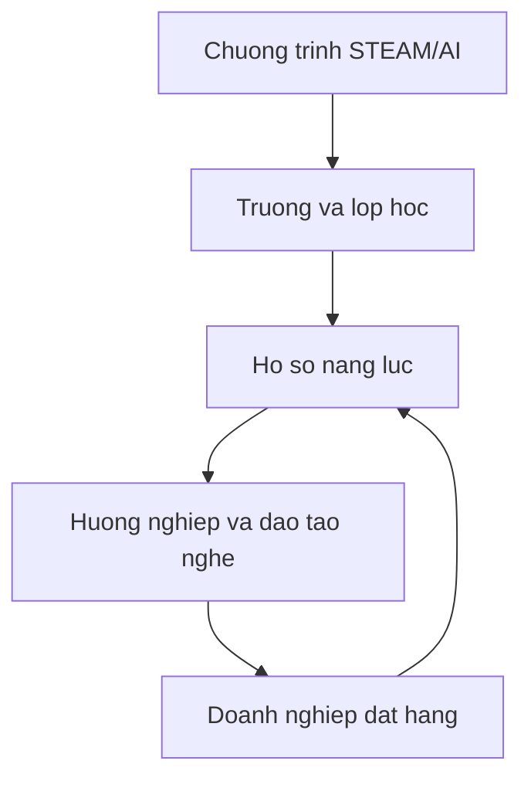

# Mo hinh nen tang

## Tong quan phan he

Nen tang can phuc vu dong thoi giao duc, huong nghiep, dao tao nghe va dat hang nhan luc.

## Phan he truong hoc

- Quan ly truong, phong STEAM va thiet bi.
- Kho chuong trinh dung chung.
- To chuc lop va chia nhom.
- Giao nhiem vu thuc hanh.
- Nhat ky san pham va phien ban.
- Cham rubric.
- Portfolio tung hoc sinh.
- Dashboard ban giam hieu.

## Phan he AI cho giao vien

- Tro ly soan giao an.
- Tao hoc lieu tu chuong trinh da duyet.
- Tao cau hoi va rubric.
- Goi y cach ho tro hoc sinh.
- Tra cuu loi thiet bi va code.
- Phan tich ket qua lop hoc.
- Giao vien la nguoi duyet cuoi cung.

## Phan he nang luc va huong nghiep

- Skill graph dung chung cho STEAM, nghe va viec lam.
- Minh chung gom san pham, code, du lieu, video va nhan xet.
- De xuat khoa tiep theo.
- Ban do nhom nghe.
- Khong gan nhan co dinh cho hoc sinh.

## Phan he doanh nghiep

- Tao don hang nhan luc.
- Khai bao ma tran nang luc.
- Tai tro hoac dong xay chuong trinh.
- Theo doi nguon hoc vien.
- Dua bai danh gia thuc hanh.
- Quan ly phong van va ket qua tuyen chon.

## Phan he viec lam quoc te

- Chi danh cho nguoi du dieu kien va tu nguyen tham gia.
- Ket noi don vi co giay phep.
- Theo doi ngoai ngu, ky nang va ho so.
- Cong khai chi phi va trang thai.
- Nen tang khong tu dung ten hoat dong dua nguoi lao dong ra nuoc ngoai neu chua co giay phep tuong ung.

