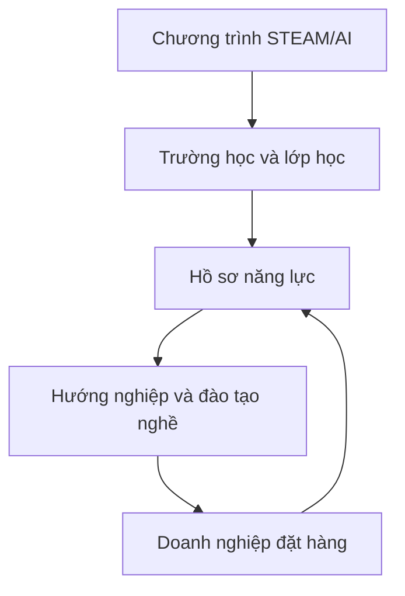

# Mô hình nền tảng

## Tổng quan các phân hệ

Nền tảng cần phục vụ đồng thời giáo dục, hướng nghiệp, đào tạo nghề và đặt hàng nhân lực.

## Phân hệ trường học

- Quản lý trường, phòng STEAM và thiết bị.
- Kho chương trình dùng chung.
- Tổ chức lớp học và chia nhóm.
- Giao nhiệm vụ thực hành.
- Nhật ký sản phẩm và lịch sử phiên bản.
- Chấm điểm theo rubric.
- Portfolio của từng học sinh.
- Dashboard dành cho ban giám hiệu.

## Phân hệ AI dành cho giáo viên

- Trợ lý soạn giáo án.
- Tạo học liệu từ chương trình đã được phê duyệt.
- Tạo câu hỏi và rubric.
- Gợi ý phương án hỗ trợ từng nhóm học sinh.
- Tra cứu lỗi thiết bị và lỗi code.
- Phân tích kết quả lớp học.
- Giáo viên là người kiểm tra và phê duyệt cuối cùng.

## Phân hệ năng lực và hướng nghiệp

- Skill graph dùng chung cho STEAM, đào tạo nghề và việc làm.
- Minh chứng năng lực gồm sản phẩm, code, dữ liệu, video và nhận xét.
- Đề xuất khóa học hoặc lộ trình tiếp theo.
- Bản đồ các nhóm nghề.
- Không gắn nhãn nghề nghiệp cố định cho học sinh.

## Phân hệ doanh nghiệp

- Tạo đơn hàng nhân lực.
- Khai báo ma trận năng lực cần thiết.
- Tài trợ hoặc đồng xây dựng chương trình đào tạo.
- Theo dõi nguồn học viên tiềm năng.
- Đưa bài đánh giá thực hành vào chương trình.
- Quản lý phỏng vấn và kết quả tuyển chọn.

## Phân hệ việc làm quốc tế

- Chỉ dành cho người đủ điều kiện và tự nguyện tham gia.
- Kết nối với các đơn vị có giấy phép phù hợp.
- Theo dõi ngoại ngữ, kỹ năng và hồ sơ.
- Công khai chi phí và trạng thái xử lý.
- Nền tảng không tự đứng tên hoạt động đưa người lao động ra nước ngoài khi chưa có giấy phép tương ứng.
