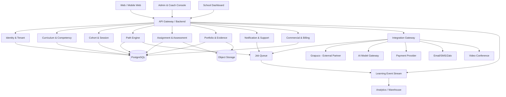
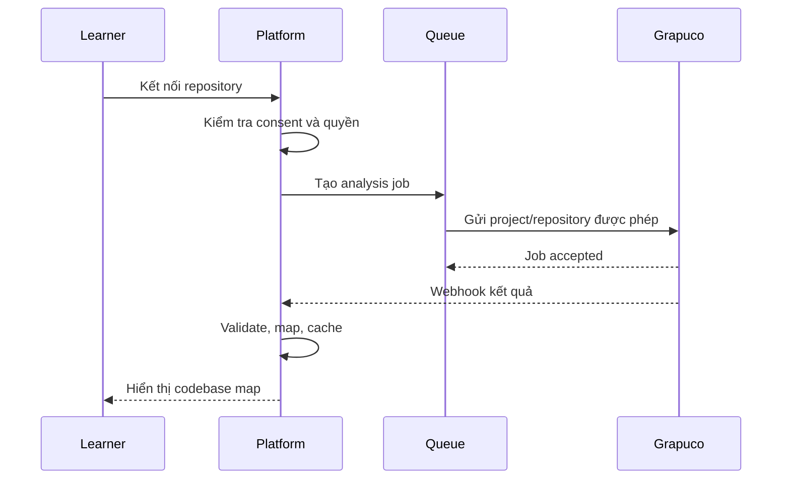

# Phương án triển khai kỹ thuật học từ mô hình TUMO

> Cập nhật: 2026-08-05  
> Trạng thái: đề xuất kiến trúc greenfield.  
> Ràng buộc: chỉ kế thừa các chương trình giảng dạy do anh Đức đã soạn; không kế thừa SOPai, Arkon, henlich.vn hoặc nền tảng cũ. Grapuco là đối tác ngoài.

---

## 1. Mục tiêu kỹ thuật

Nền tảng không được thiết kế như một LMS chỉ để:

- phát video;
- giao bài;
- chấm điểm;
- cấp chứng chỉ.

Mục tiêu là xây một **Learning Operating System** có khả năng:

1. Quản lý nhiều trường, nhiều chương trình và nhiều cohort.
2. Chuyển chương trình đã soạn thành activity graph và competency graph.
3. Tạo lộ trình cá nhân trong phạm vi từng chương trình.
4. Phân bổ workshop, giảng viên, thời gian và tài nguyên.
5. Quản lý sản phẩm, rubric và hồ sơ minh chứng.
6. Hỗ trợ coach/điều phối viên thay vì phụ thuộc hoàn toàn vào giảng viên.
7. Kết nối chuyên gia và workshop nâng cao.
8. Kết nối Grapuco cho Vibe Coding qua integration gateway.
9. Tạo dữ liệu để cấp quyền chương trình và triển khai nhiều trường.
10. Phát triển AI co-learner sau khi dữ liệu và quy trình cốt lõi ổn định.

---

## 2. Nguyên tắc kiến trúc

- **Greenfield:** codebase, database và hạ tầng mới.
- **Modular monolith trước:** không tạo microservice quá sớm.
- **API-first:** frontend, mobile và đối tác dùng API rõ ràng.
- **Multi-tenant:** tách dữ liệu theo trường/cơ sở.
- **Event-aware:** mọi hành động học tập quan trọng tạo event.
- **Curriculum as data:** chương trình không hard-code trong source.
- **Portfolio-first:** sản phẩm và minh chứng là dữ liệu cấp một.
- **Human-in-the-loop:** AI không tự quyết định kết quả cuối.
- **Vendor-independent:** thay được model AI, dịch vụ nhắn tin và Grapuco.
- **Observable:** log, metric, trace và audit trail ngay từ đầu.
- **Privacy-by-design:** thu đúng dữ liệu cần thiết và kiểm soát chia sẻ.

---

## 3. Ba phương án triển khai

## 3.1. Phương án A — LMS nhanh

### Mô tả

Dùng một LMS phổ biến hoặc headless LMS, bổ sung một số module:

- multi-tenant;
- rubric;
- portfolio;
- báo cáo trường;
- Grapuco integration.

### Ưu điểm

- nhanh mở lớp;
- nhiều chức năng có sẵn;
- chi phí phát triển ban đầu thấp;
- ít rủi ro kỹ thuật.

### Nhược điểm

- khó xây Path Engine đúng nghĩa;
- data model bị khóa vào course–lesson–quiz;
- khó điều phối workshop và tài nguyên;
- portfolio và competency graph thường là add-on;
- trải nghiệm Vibe Coding bị rời rạc;
- khó tạo lợi thế sản phẩm dài hạn.

### Kết luận

Chỉ phù hợp làm phương án tạm hoặc backend vận hành 1–2 tháng đầu. Không nên là kiến trúc đích.

---

## 3.2. Phương án B — Modular Learning OS

### Mô tả

Xây mới một modular monolith có các domain độc lập trong cùng codebase và database.

### Ưu điểm

- phù hợp đội nhỏ;
- triển khai nhanh hơn microservice;
- giữ toàn quyền data model;
- xây được Path Engine;
- dễ tích hợp Grapuco;
- có thể tách service sau khi có tải thật.

### Nhược điểm

- cần thiết kế domain kỹ ngay từ đầu;
- phải tự xây nhiều chức năng cơ bản;
- cần kỷ luật module boundary;
- MVP không thể có mọi tính năng.

### Kết luận

Đây là phương án khuyến nghị.

---

## 3.3. Phương án C — Microservice và AI-native ngay từ đầu

### Mô tả

Tách sớm thành:

- identity service;
- curriculum service;
- path service;
- scheduling service;
- portfolio service;
- assessment service;
- AI service;
- integration service;
- analytics service.

### Ưu điểm

- linh hoạt mở rộng;
- mỗi service có vòng đời riêng;
- phù hợp mạng lưới rất lớn.

### Nhược điểm

- chi phí DevOps cao;
- distributed transaction;
- observability phức tạp;
- chậm ra MVP;
- quá tải cho đội core nhỏ;
- rất dễ xây sai trước khi có dữ liệu sử dụng.

### Kết luận

Không chọn trong 12 tháng đầu. Chỉ tách service khi có bằng chứng về tải, ownership và chu kỳ phát hành khác nhau.

---

## 4. Kiến trúc khuyến nghị



---

## 5. Stack kỹ thuật đề xuất

## 5.1. Frontend

### Khuyến nghị

- React/Next.js hoặc framework TypeScript tương đương.
- Responsive web trước, mobile app sau.
- Design system dùng chung cho learner, coach và admin.

### Các ứng dụng

1. Learner Portal.
2. Coach/Instructor Console.
3. School Dashboard.
4. Platform Admin.
5. Public enrollment/landing.

Không nên nhét tất cả vai trò vào một giao diện với menu điều kiện quá phức tạp.

## 5.2. Backend

### Khuyến nghị

- TypeScript modular monolith.
- NestJS hoặc framework có module boundary, DI, validation và OpenAPI tốt.
- REST API trước; GraphQL chỉ dùng khi có bài toán client aggregation rõ.

Lý do:

- đội nhỏ;
- dùng chung type;
- dễ tuyển dev;
- tốc độ phát triển tốt;
- tách service được về sau.

## 5.3. AI worker

Dùng Python service riêng cho:

- xử lý multimodal;
- chấm sơ bộ;
- embedding/RAG;
- co-learner;
- analytics hoặc recommendation nâng cao.

Không đưa toàn bộ backend sang Python chỉ vì có AI.

## 5.4. Database

### PostgreSQL

Dùng PostgreSQL làm source of truth cho:

- tenant;
- user;
- chương trình;
- graph prerequisite;
- cohort;
- enrollment;
- submission;
- rubric;
- đánh giá;
- portfolio metadata;
- hợp đồng và quyền sử dụng.

### Graph model

Giai đoạn đầu không cần Neo4j.

Có thể biểu diễn graph bằng:

- competency;
- activity;
- edge;
- prerequisite rule;
- mastery record;

trong PostgreSQL.

Chỉ bổ sung graph database khi:

- graph traversal trở thành nút thắt;
- skill graph có quy mô lớn;
- recommendation cần truy vấn nhiều bước phức tạp;
- đội có năng lực vận hành thêm database.

## 5.5. File và sản phẩm

Dùng object storage tương thích S3 cho:

- video;
- slide;
- file bài tập;
- sản phẩm;
- ảnh;
- artifact build;
- portfolio evidence.

Metadata và quyền nằm trong PostgreSQL, không phụ thuộc vào cấu trúc folder của storage.

## 5.6. Queue và background jobs

Dùng Redis/BullMQ, RabbitMQ hoặc dịch vụ queue managed cho:

- gửi thông báo;
- tạo báo cáo;
- xử lý file;
- chấm sơ bộ;
- đồng bộ Grapuco;
- webhook retry;
- tạo portfolio preview;
- tính lại learning path.

## 5.7. Deployment

### Giai đoạn đầu

- Docker.
- Managed PostgreSQL.
- Managed object storage.
- Container Apps/ECS/Fargate/Cloud Run hoặc dịch vụ tương đương.
- CDN.
- Secret manager.
- Backup tự động.

Không cần Kubernetes trước khi có:

- nhiều service;
- tải lớn;
- đội platform/DevOps;
- yêu cầu triển khai phức tạp.

---

## 6. Domain model cốt lõi

## 6.1. Organization

- tenant;
- trường/cơ sở;
- khoa/phòng;
- campus;
- đối tác;
- hợp đồng;
- cấu hình thương hiệu;
- data policy.

## 6.2. Program

- program;
- version;
- target audience;
- learning outcome;
- competency framework;
- activity;
- workshop;
- lab;
- prerequisite;
- rubric;
- completion rule;
- licensing rule.

## 6.3. Learner

- profile;
- organization;
- interest;
- availability;
- prior competency;
- current mastery;
- enrollment;
- learning path;
- support needs;
- consent.

## 6.4. Cohort và resource

- cohort;
- group;
- session;
- timeslot;
- room;
- device/resource;
- instructor;
- coach;
- capacity;
- waitlist.

## 6.5. Evidence

- submission;
- code repository;
- file;
- URL;
- demo video;
- screenshot;
- rubric score;
- feedback;
- reviewer;
- version;
- appeal.

## 6.6. Portfolio

- project;
- contribution;
- competency evidence;
- visibility;
- share link;
- verification;
- employer/school view.

---

## 7. Curriculum Graph

## 7.1. Chuyển chương trình đã soạn thành dữ liệu

Mỗi chương trình cần được chuẩn hóa thành:

```yaml
program:
  id: ai-fluency
  version: 1.0
  outcomes:
    - describe-ai-task
    - evaluate-ai-output
  activities:
    - id: activity-01
      type: self_learning
      prerequisites: []
      evidence: quiz_and_artifact
    - id: workshop-01
      type: workshop
      prerequisites:
        - activity-01
      capacity: 30
      rubric: rubric-01
```

Đây chỉ là ví dụ mô hình dữ liệu.

## 7.2. Các loại node

- orientation;
- diagnostic;
- self-learning;
- guided practice;
- workshop;
- project;
- lab;
- review;
- remediation;
- showcase.

## 7.3. Các loại edge

- prerequisite;
- recommended-next;
- alternative;
- remediation;
- specialization;
- equivalent;
- unlocks;
- requires-resource.

---

## 8. Path Engine

## 8.1. Phiên bản 1 — Rule-based

Dùng trong 3–6 tháng đầu.

Path Engine lọc hoạt động theo:

- prerequisite;
- chương trình đang học;
- năng lực chưa đạt;
- lịch rảnh;
- workshop còn chỗ;
- tài nguyên;
- deadline;
- quy định của trường.

Sau đó xếp hạng theo trọng số cấu hình.

### Ưu điểm

- giải thích được;
- dễ kiểm thử;
- không cần dữ liệu lớn;
- giáo vụ kiểm soát được.

## 8.2. Phiên bản 2 — Data-informed ranking

Sau khi có dữ liệu:

- tỷ lệ hoàn thành;
- thời gian hoạt động;
- bỏ cuộc;
- mức hứng thú;
- chất lượng sản phẩm;
- tải coach;

có thể hiệu chỉnh trọng số theo nhóm người học.

## 8.3. Phiên bản 3 — Recommendation/Optimization

Chỉ làm khi đủ dữ liệu.

Có thể dùng:

- learning-to-rank;
- contextual bandit;
- constraint optimization;
- sequence model;
- causal evaluation.

Không để model phá prerequisite, lịch, capacity hoặc quy định học vụ.

---

## 9. Scheduling Engine

Scheduling của mô hình TUMO khó hơn xếp lịch lớp truyền thống vì phải kết hợp:

- lịch người học;
- prerequisite;
- workshop level;
- specialist;
- phòng;
- thiết bị;
- capacity;
- nhu cầu nhiều trường;
- ưu tiên người chờ lâu;
- di chuyển giữa Node và Hub nếu có.

## 9.1. Giai đoạn đầu

- tạo slot thủ công;
- hệ thống kiểm tra xung đột;
- learner đăng ký;
- waitlist;
- admin xác nhận.

## 9.2. Giai đoạn sau

Dùng constraint solver để tối ưu:

- số người được phục vụ;
- mức sử dụng phòng;
- khoảng trống giảng viên;
- công bằng giữa trường;
- giảm hủy slot;
- prerequisite readiness.

---

## 10. Coach Console

Coach Console là chức năng bắt buộc, không phải add-on.

Coach cần thấy:

- người học đang làm gì;
- ai bị kẹt;
- ai vắng;
- ai chậm tiến độ;
- ai chưa có sản phẩm;
- câu hỏi chưa xử lý;
- phản hồi AI cần duyệt;
- đề xuất bước tiếp theo;
- lịch workshop phù hợp;
- cảnh báo rủi ro bỏ cuộc.

Hệ thống phải ưu tiên ngoại lệ, không bắt coach đọc toàn bộ dữ liệu.

---

## 11. Portfolio và living diploma

## 11.1. Cấu trúc

Mỗi project gồm:

- vấn đề;
- vai trò người học;
- sản phẩm;
- repository/file/demo;
- công cụ sử dụng;
- rubric;
- phản hồi;
- phiên bản;
- năng lực được chứng minh;
- xác nhận người duyệt.

## 11.2. Khác chứng chỉ

Chứng chỉ xác nhận tham gia/hoàn thành.

Portfolio chứng minh:

- người học làm được gì;
- làm ở mức nào;
- vai trò trong nhóm;
- quá trình cải tiến;
- chất lượng theo rubric.

Nền tảng nên hỗ trợ cả hai, nhưng portfolio là tài sản khác biệt.

---

## 12. Tích hợp Grapuco

## 12.1. Vai trò

Grapuco hỗ trợ:

- codebase map;
- module/dependency/call graph;
- flow;
- context cho coding agent;
- spec-first;
- impact analysis;
- trình bày kiến trúc dự án.

## 12.2. Kiến trúc adapter



## 12.3. Dữ liệu

Mặc định không gửi:

- dữ liệu hồ sơ người học;
- điểm;
- email/số điện thoại;
- dữ liệu trường;
- repository không có consent;
- secret;
- file cấu hình chứa credential.

## 12.4. Fallback

Nếu Grapuco lỗi hoặc chưa ký hợp đồng:

- khóa học vẫn hoạt động;
- người học vẫn dùng GitHub và IDE;
- kiến trúc được trình bày bằng sơ đồ thủ công;
- submission và rubric không phụ thuộc Grapuco.

---

## 13. AI co-learner

## 13.1. Không xây chatbot hỏi gì đáp nấy

Co-learner nên có state machine:

1. Observe — AI làm mẫu một phần.
2. Ask — AI hỏi người học giải thích.
3. Struggle — AI đưa ra lỗi có chủ đích.
4. Hint — AI đưa gợi ý giới hạn.
5. Reflect — người học giải thích lại.
6. Assess — AI đánh giá sơ bộ theo rubric.
7. Escalate — chuyển coach khi cần.

## 13.2. Các guardrail

- không đưa full answer ở nhiệm vụ đang đánh giá;
- giới hạn công cụ theo activity;
- lưu prompt/version;
- log nguồn và model;
- kiểm tra output;
- coach có thể xem và sửa;
- không dùng AI score làm điểm cuối nếu chưa được hiệu chuẩn;
- có nút báo lỗi và chuyển người thật.

## 13.3. Kiến trúc AI

- Model Gateway.
- Prompt/Policy Registry.
- Retrieval service.
- Learner context builder.
- Tool permission layer.
- Evaluation service.
- Human review queue.
- Cost and token monitoring.

---

## 14. Learning Event Model

Mọi sự kiện quan trọng cần ghi:

- learner_registered;
- program_enrolled;
- activity_started;
- activity_completed;
- workshop_unlocked;
- workshop_booked;
- session_attended;
- submission_created;
- feedback_received;
- competency_demonstrated;
- coach_intervened;
- ai_handoff;
- portfolio_published;
- learner_inactive;
- program_completed.

Event giúp:

- dashboard;
- recommendation;
- cảnh báo;
- báo cáo trường;
- tính unit economics;
- nghiên cứu hiệu quả chương trình.

---

## 15. Multi-tenancy và bảo mật

## 15.1. Tách tenant

Mọi bảng nghiệp vụ cần tenant_id hoặc organization_id.

Cần:

- row-level authorization;
- tenant-aware query;
- object storage prefix/policy;
- cache key theo tenant;
- log tenant;
- kiểm thử chống cross-tenant access.

## 15.2. Role

- platform admin;
- organization admin;
- school coordinator;
- instructor;
- coach;
- reviewer;
- learner;
- parent/observer nếu cần;
- external expert;
- integration service account.

## 15.3. Dữ liệu

- consent;
- retention;
- export;
- correction;
- deletion/anonymization;
- audit log;
- encryption;
- secret scanning cho Vibe Coding;
- giới hạn dữ liệu gửi đối tác.

---

## 16. Observability và vận hành

Theo dõi:

### Kỹ thuật

- uptime;
- latency;
- error rate;
- queue lag;
- webhook failure;
- database load;
- storage;
- deploy frequency;
- rollback.

### Giáo dục

- active learner;
- completion;
- time-on-activity;
- workshop fill rate;
- waitlist;
- coach intervention;
- feedback latency;
- portfolio completion;
- mastery progression.

### Kinh doanh

- school activation;
- active seats;
- license utilization;
- support cost;
- AI/Grapuco cost;
- renewal;
- revenue per tenant;
- contribution per program.

---

## 17. Lộ trình kỹ thuật đề xuất

## Giai đoạn 0 — 1–2 tuần: thiết kế lõi

- chốt domain model;
- chuẩn hóa hai chương trình đã có;
- thiết kế curriculum schema;
- xác định tenant và role;
- dựng CI/CD;
- dựng database và object storage;
- dựng design system;
- chốt hợp đồng API nội bộ.

## Giai đoạn 1 — 2–6 tuần: vertical slice vận hành lớp thật

- auth;
- trường/cohort;
- người học;
- chương trình;
- học liệu;
- assignment;
- submission;
- rubric;
- điểm danh;
- dashboard cơ bản;
- export báo cáo.

Mục tiêu: chạy được cohort thật, dù một số thao tác còn thủ công.

## Giai đoạn 2 — 7–12 tuần: Learning OS v1

- competency graph;
- prerequisite;
- Path Engine rule-based;
- workshop enrollment;
- waitlist;
- Coach Console;
- portfolio;
- notification;
- event tracking;
- tenant billing.

## Giai đoạn 3 — 13–20 tuần: Vibe Coding và Grapuco

- GitHub/repository connection;
- Grapuco adapter;
- async analysis job;
- codebase map;
- project evidence;
- architecture rubric;
- secret/data protection;
- fallback mode.

## Giai đoạn 4 — 21–32 tuần: AI co-learner pilot

- model gateway;
- activity policy;
- co-learner state machine;
- RAG trên học liệu;
- human review;
- evaluation;
- cost control;
- A/B test trong phạm vi nhỏ.

## Giai đoạn 5 — 33–52 tuần: network operating system

- capacity optimization;
- advanced scheduling;
- program licensing;
- partner portal;
- localized configuration;
- data warehouse;
- renewal analytics;
- Hub–Node management;
- recommendation v2.

---

## 18. Đội kỹ thuật tối thiểu

### Giai đoạn đầu

- 1 product/solution owner.
- 1 senior full-stack/architect.
- 1 full-stack developer.
- 1 frontend/product engineer hoặc designer có khả năng implement.
- 1 QA/operations part-time hoặc kết hợp.
- 1 AI engineer part-time từ giai đoạn 3.

Nếu chỉ có một dev, phải:

- giảm phạm vi;
- dùng managed services;
- không làm AI co-learner sớm;
- không làm app mobile native;
- không làm microservice;
- không xây payment phức tạp;
- không làm recommendation ML.

---

## 19. Build vs Buy

| Thành phần | Khuyến nghị |
|---|---|
| Curriculum graph | Tự xây |
| Path Engine | Tự xây |
| Portfolio/evidence | Tự xây |
| Multi-school dashboard | Tự xây |
| Grapuco code intelligence | Mua/tích hợp đối tác |
| Payment | Tích hợp nhà cung cấp |
| Email/SMS/Zalo | Tích hợp nhà cung cấp |
| Video meeting | Tích hợp nhà cung cấp |
| Object storage | Managed service |
| Auth ban đầu | Managed hoặc open-source chuẩn |
| Analytics cơ bản | Tự ghi event + BI tool |
| AI model | Multi-provider API/gateway |
| LMS commodity | Có thể mua tạm nhưng không làm lõi |

---

## 20. Quyết định khuyến nghị

Chọn **Phương án B — Modular Learning OS**.

Cấu hình:

- React/Next.js frontend.
- TypeScript modular backend.
- PostgreSQL.
- Object storage.
- Redis/queue.
- Docker trên managed container platform.
- Python AI worker khi cần.
- Integration Gateway.
- Grapuco external adapter.
- Path Engine rule-based trước.
- AI co-learner sau khi có dữ liệu.

Không chọn:

- LMS làm kiến trúc đích;
- microservice ngay từ đầu;
- graph database ngay từ đầu;
- Kubernetes ngay từ đầu;
- AI tutor đầy đủ trong tháng đầu;
- phụ thuộc bắt buộc vào Grapuco hoặc một model AI.

---

## 21. Tiêu chí nghiệm thu kiến trúc sau 90 ngày

1. Hai chương trình đã soạn được import thành dữ liệu có version.
2. Tối thiểu 3 trường được tách tenant đúng.
3. 500–1.000 tài khoản có thể hoạt động mà không trộn dữ liệu.
4. Người học nhận nhiệm vụ, nộp sản phẩm và nhận rubric.
5. Coach thấy được ngoại lệ và người học bị kẹt.
6. Trường xuất được báo cáo tiến độ.
7. Portfolio có bằng chứng xác minh.
8. Path Engine v1 đề xuất được bước tiếp theo và giải thích lý do.
9. Grapuco có adapter riêng hoặc có mock/fallback rõ ràng.
10. Log, backup và audit hoạt động.
11. Chi phí hạ tầng, AI và đối tác được đo riêng.
12. Không có dependency vào SOPai, Arkon hoặc henlich.vn.
